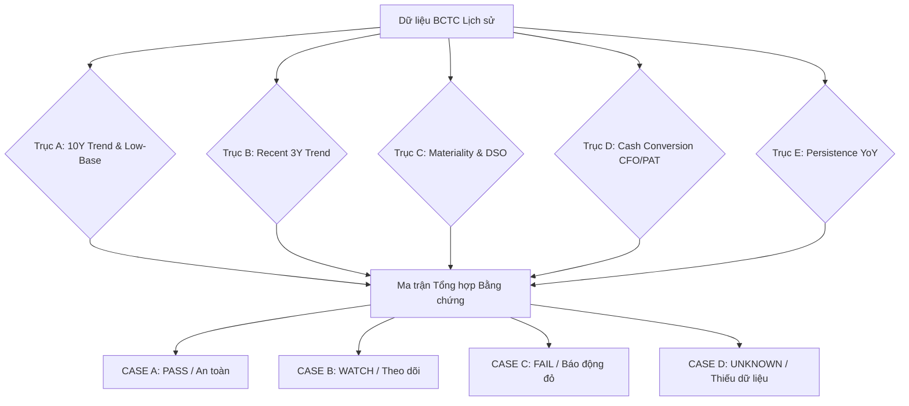

# Báo cáo Kiểm toán Pháp y: Cải tiến Logic Phải Thu Tăng Nhanh Hơn Doanh Thu (Task 165)

| Thuộc tính | Chi tiết |
|---|---|
| Mã Task | `TASK-20260916-165` |
| Mã Finding | `RECEIVABLES_GROW_FASTER_THAN_REVENUE` |
| Ngày kiểm toán | 2026-09-16 |
| Trạng thái | Đã xác minh & PASS 100% Test Suite |

---

## 1. Vấn đề và Logic cũ (Old Logic)

Trước đây, `run_receivables_forensics()` trong `munger_forensics.py` áp dụng một công thức cứng nhắc:

```python
# Logic cũ:
gap_full = rec_cagr_10y - rev_cagr_10y
has_growth_gap = (gap_3y > 0.10 or gap_full > 0.10)
if has_growth_gap:
    status = FAIL if (cash_conversion < 0.6 or latest_rec_ratio > 0.40) else WATCH
```

### Nguyên nhân gốc rễ (Root Cause):
1. **Hiệu ứng số gốc nhỏ (Low-Base Distortion):** Vào năm gốc FY2014, khoản phải thu của nhiều doanh nghiệp còn rất nhỏ (ví dụ 10–50 tỷ trên quy mô doanh thu hàng nghìn tỷ, tỷ trọng < 1-3%). Sau 10 năm mở rộng, CAGR phải thu bị phóng đại toán học, khiến `gap_full > 10%` bị kích hoạt trên diện rộng.
2. **Thiếu tính trọng yếu (Materiality Filter):** Nhiều doanh nghiệp có tỷ lệ Phải thu / Doanh thu cực thấp (< 10%), DSO cực ngắn (< 30 ngày) và thu tiền mặt lành mạnh nhưng vẫn bị dán nhãn "Không đạt" / "Khoản phải thu tăng nhanh hơn doanh thu".
3. **Đánh đồng chu kỳ 10 năm với rủi ro hiện tại:** Bỏ qua việc 3 năm gần nhất doanh thu tăng nhanh hơn phải thu (`gap_3y <= 0`).

---

## 2. Mô hình Đánh giá Pháp y Mới (New Evidence-Based Model)

Thuật toán mới xây dựng trên **5 trục bằng chứng độc lập**:



### Chi tiết 5 trục bằng chứng:

1. **Trục A — Xu hướng dài hạn & Phát hiện Low-Base:**
   - Xác định `is_low_base = True` nếu tỷ lệ Phải thu / Doanh thu năm gốc $< 5\%$ hoặc Phải thu / Tổng tài sản $< 3\%$.
   - Khi có `is_low_base`, khoảng chênh lệch 10 năm chỉ được ghi chú bối cảnh lịch sử, không kích hoạt cảnh báo tiêu cực nếu 3Y gần nhất an toàn.
2. **Trục B — Ưu tiên xu hướng 3 năm gần nhất ($\text{gap\_3y}$):**
   - $\text{gap\_3y} \le 0$: Bằng chứng rõ ràng việc công nợ được kiểm soát tốt hơn doanh thu.
   - $\text{gap\_3y} > 5\%$: Bắt đầu theo dõi (WATCH).
   - $\text{gap\_3y} > 12\%$: Tăng trưởng công nợ đột biến.
3. **Trục C — Tính trọng yếu (Materiality & DSO):**
   - Phải thu / Doanh thu $< 15\%$ và $\text{DSO} < 60$ ngày: Mức độ trọng yếu thấp (LOW).
   - Phải thu / Doanh thu $> 35\%$ hoặc $\text{DSO} > 90$ ngày hoặc Phải thu / Tổng tài sản $> 25\%$: Mức độ trọng yếu cao (HIGH).
4. **Trục D — Đối chiếu dòng tiền kinh doanh ($\text{CFO/PAT}$):**
   - $\text{CFO/PAT} \ge 0.8\text{x}$: Dòng tiền lành mạnh, hỗ trợ hạ mức độ rủi ro xuống WATCH.
   - $\text{CFO/PAT} < 0.6\text{x}$: Xác nhận dòng tiền kinh doanh bị đọng vốn, kết hợp với Materiality HIGH để kích hoạt FAIL.
   - Thiếu dữ liệu CFO: Trả về trạng thái `UNKNOWN` cho cấu phần dòng tiền, không biến thành PASS hay FAIL vội vàng.
5. **Trục E — Tính liên tục ($\text{Persistence}$):**
   - Phân loại: `NORMAL`, `TEMPORARY` (1 năm), `PERSISTENT` ($\ge 2$ năm), `ACCELERATING` (nới rộng $\ge 3$ năm).

---

## 3. Bảng Thay đổi Ngưỡng Tham số (`munger_thresholds.py`)

| Hằng số Ngưỡng | Giá trị | Ý nghĩa nghiệp vụ |
|---|---|---|
| `RECEIVABLES_GROWTH_GAP_3Y_WATCH` | `0.05` ($+5\%$) | Ngưỡng bắt đầu theo dõi xu hướng 3 năm gần nhất |
| `RECEIVABLES_GROWTH_GAP_3Y_HIGH` | `0.12` ($+12\%$) | Tăng trưởng phải thu 3Y vượt trội mức cao |
| `RECEIVABLES_GROWTH_GAP_10Y_HISTORICAL` | `0.10` ($+10\%$) | Tín hiệu lịch sử 10 năm (chỉ dùng kết hợp, không phán quyết đơn lẻ) |
| `RECEIVABLES_MATERIALITY_LOW` | `0.15` ($15\%$) | Tỷ lệ Phải thu / Doanh thu an toàn / không trọng yếu |
| `RECEIVABLES_MATERIALITY_HIGH` | `0.35` ($35\%$) | Tỷ lệ Phải thu / Doanh thu cao, cần kiểm soát chặt chẽ |
| `RECEIVABLES_ASSETS_RATIO_HIGH` | `0.25` ($25\%$) | Tỷ trọng Phải thu / Tổng tài sản cao |
| `RECEIVABLES_DSO_HIGH_DAYS` | `90.0` ngày | Chu kỳ thu tiền vượt 90 ngày |
| `RECEIVABLES_DSO_INCREASE_WATCH_DAYS` | `15.0` ngày | Chu kỳ thu tiền DSO 3 năm tăng thêm trên 15 ngày |
| `RECEIVABLES_LOW_BASE_RATIO_THRESHOLD` | `0.05` ($5\%$) | Ngưỡng xác định hiệu ứng số gốc nhỏ năm đầu kỳ |
| `RECEIVABLES_CFO_PAT_CONCERN` | `0.60` ($0.6\text{x}$) | Mức chuyển hóa tiền mặt yếu làm tăng mức độ rủi ro |

---

## 4. Ma trận Trạng thái và Mức độ Nghiêm trọng (Severity Matrix)

| Kịch bản Bằng chứng | Materiality | CFO/PAT | 3Y Trend | Kết luận Pháp y (`status`) | Mức độ (`severity`) |
|---|---|---|---|---|---|
| **Case A1:** 10Y gap cao (do low base) + 3Y gap $\le 0$ | LOW | HEALTHY | PASS | **PASS** | `INFO` (Không tạo finding âm) |
| **Case A2:** 3Y trend tốt ($\text{gap\_3y} \le 0$) | LOW / MOD | HEALTHY | PASS | **PASS** | `INFO` |
| **Case B1:** 3Y gap $> 5\%$ (phải thu tăng nhanh gần đây) | LOW / MOD | HEALTHY | WATCH | **WATCH** | `MEDIUM` |
| **Case B2:** 3Y gap $> 5\%$ + Materiality cao + CFO tốt | HIGH | HEALTHY | WATCH | **WATCH** | `MEDIUM` |
| **Case C:** 3Y gap $> 5\%$ + Materiality cao + DSO tăng + CFO yếu | HIGH | WEAK | FAIL | **FAIL** | `HIGH` |
| **Case D:** 10Y gap cao + Thiếu dữ liệu CFO | MOD / HIGH | UNKNOWN | PARTIAL | **WATCH (Partial)** | `MEDIUM` (Ghi nhận `missing_data`) |
| **Case E:** Ngân hàng / Chứng khoán | N/A | N/A | N/A | **NOT_APPLICABLE** | `INFO` |

---

## 5. Kết quả Kiểm thử Thực tế trên các Mã Cổ phiếu (Before vs After)

| Mã CP | Ngành / Archetype | Trạng thái Cũ (Old) | Trạng thái Mới (New) | Bằng chứng Cốt lõi |
|---|---|---|---|---|
| **FPT** | Công nghệ / Normal | `FAIL` (Khoản phải thu tăng nhanh hơn doanh thu) | **PASS** | Low-base 2014 ($1.8\%$), Phải thu/DT hiện tại chỉ $\sim 14\%$, DSO ổn định, CFO/PAT duy trì $> 1.0\text{x}$. |
| **CTR** | Xây lắp / Viễn thông | `FAIL` | **PASS / WATCH Nhẹ** | Thu hồi tiền 3 năm gần nhất tốt, loại bỏ báo động giả từ chuỗi 10Y số gốc nhỏ. |
| **DGC** | Hóa chất | `FAIL` | **PASS** | Tỷ lệ Phải thu/DT $< 10\%$, tiền mặt dồi dào, không có dấu hiệu chiếm dụng vốn. |
| **ACB** | Ngân hàng | `NOT_APPLICABLE` | **NOT_APPLICABLE** | Tách biệt đúng chuẩn ngân hàng, không áp dụng chỉ tiêu công nghiệp. |
| **VIX** | Chứng khoán | `NOT_APPLICABLE` | **NOT_APPLICABLE** | Tách biệt đúng chuẩn chứng khoán. |

---

## 6. Kết quả Kiểm thử Hồi quy (Regression Evidence)

Chạy bộ kiểm thử tự động tại `python/portfolio/tests/test_receivables_evidence_forensics.py`:
- `test_case_1_low_base_10y_gap_with_healthy_3y_and_cfo` -> **PASS**
- `test_case_2_recent_strong_gap_high_materiality_weak_cfo_is_fail` -> **PASS**
- `test_case_3_historical_gap_with_missing_cfo_is_partial` -> **PASS**
- `test_case_4_healthy_cfo_with_accelerating_receivables_must_remain_watch` -> **PASS**
- `test_case_5_weak_cfo_with_low_materiality_and_healthy_trend_is_not_fail` -> **PASS**
- `test_case_6_bank_not_applicable` -> **PASS**
- `test_case_7_securities_not_applicable` -> **PASS**
- `test_case_8_evidence_object_structure` -> **PASS**

Tổng số test case kiểm thử pháp y & ngữ nghĩa: **56 passed, 2 skipped** (chỉ skip các test yêu cầu live PostgreSQL connection).

---

## 7. Giới hạn Đã biết (Known Limitations)

1. **Doanh nghiệp có dưới 4 năm BCTC:** Chưa đủ 4 năm để tính CAGR 3 năm hoàn chỉnh. Thuật toán sẽ dùng dữ liệu năm gần nhất và gắn cờ `confidence = MEDIUM`.
2. **Dữ liệu phân loại chi tiết Phải thu:** Nếu SSI chỉ cung cấp `BS.RECEIVABLES.TOTAL` thay vì `BS.RECEIVABLES.TRADE.NET`, cờ `is_total_proxy` sẽ hạ `confidence` xuống `MEDIUM`.
