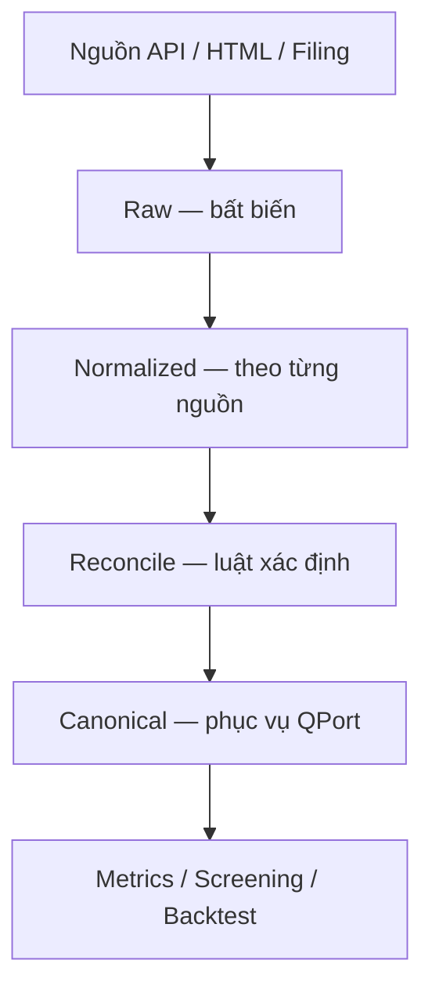

# QFD-200 — Ba lớp dữ liệu

## Claim

1. **Raw:** payload/HTML/document nguyên bản, append-only.
2. **Normalized:** dữ liệu từng nguồn đã chuẩn hóa tên chỉ tiêu, kỳ, đơn vị; chưa chọn nguồn thắng.
3. **Canonical:** một record được chọn cho mỗi identity key, có quality status và dẫn ngược về evidence.

Không được ghi thẳng từ connector vào canonical.

## Relationships

- supports: [QFD-000](./20260825-qfd-000-tuyen-ngon-he-thong.md)
- supports: [QFD-210](./20260825-qfd-210-identity-key-cua-mot-financial-fact.md)
- supports: [QFD-220](./20260825-qfd-220-providerfact-contract.md)
- supports: [QFD-300](./20260825-qfd-300-reconciliation-engine-xac-dinh.md)
- supports: [QFD-420](./20260825-qfd-420-luoc-do-luu-tru-toi-thieu.md)
