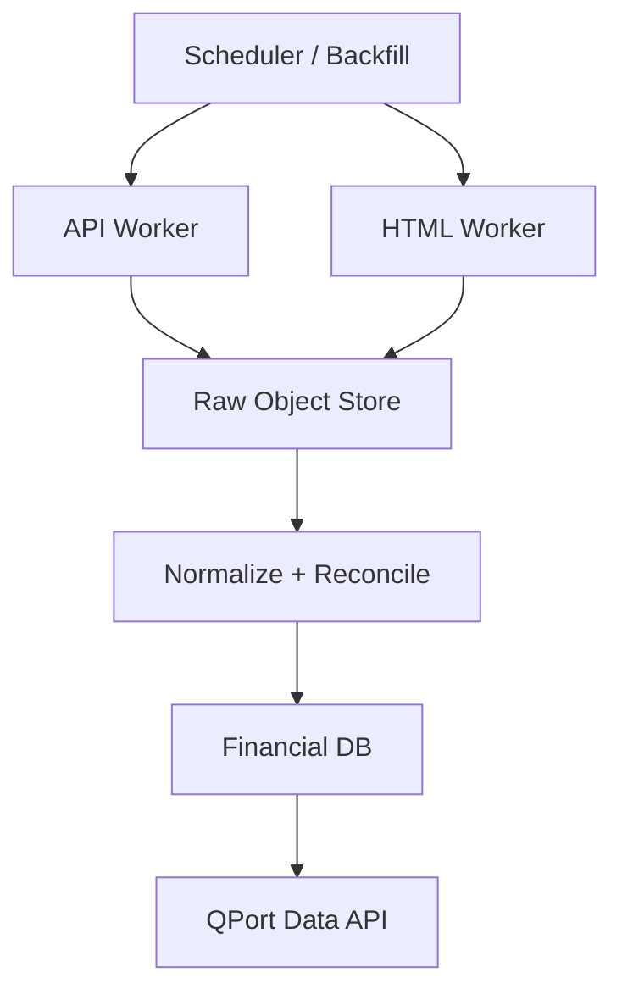

# QFD-400 — Kiến trúc dịch vụ

## Claim

API worker và HTML worker chạy tách process/container. Lỗi dependency, memory leak hoặc anti-bot ở một provider không được làm chết portfolio service.

## Relationships

- supports: [QFD-100](./20260825-qfd-100-he-a-api-ingestion.md)
- supports: [QFD-110](./20260825-qfd-110-he-b-html-ingestion.md)
- supports: [QFD-200](./20260825-qfd-200-ba-lop-du-lieu.md)
- supports: [QFD-410](./20260825-qfd-410-connector-boundary-va-provider-registry.md)
- supports: [QFD-420](./20260825-qfd-420-luoc-do-luu-tru-toi-thieu.md)
