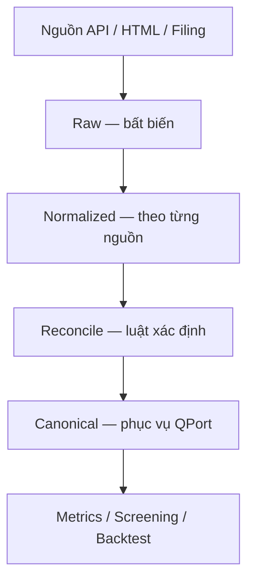
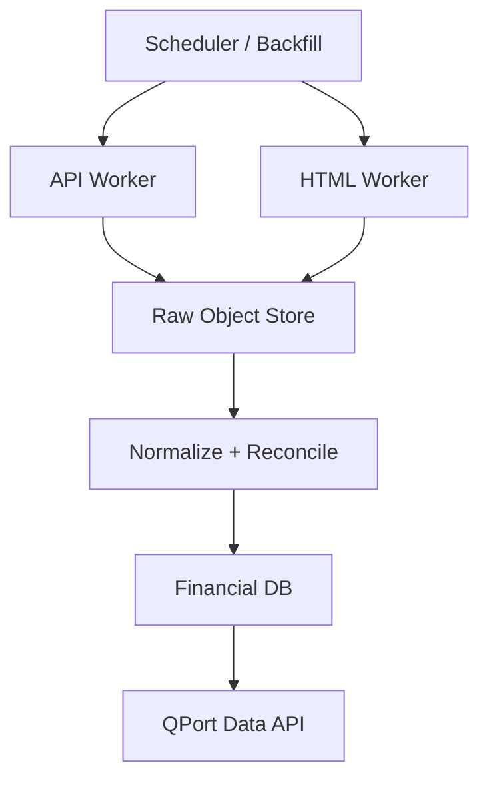

# QPort Financial Data System — Original Design Specification

This source note preserves the complete user-provided design used to derive the permanent notes. It is a design source, not independent verification of time-sensitive provider behavior.

## Source content

# QPort Financial Data System — Zettelkasten Design

---
title: QPort Financial Data System — Zettelkasten Design
document_id: QFD-ZK-001
version: 1.0.0
status: proposed
language: vi
created: 2026-08-25
owners: [QPort, Shannon Allocation]
scope: financial-data-ingestion-normalization-reconciliation
---

> Mục đích: đặc tả một hệ thống dữ liệu tài chính/doanh nghiệp Việt Nam có hai đường lấy dữ liệu — API và HTML — rồi hợp nhất có kiểm chứng. Tài liệu được viết dưới dạng các ghi chú nguyên tử theo phong cách Zettelkasten để con người và AI có thể đọc, liên kết, sửa và triển khai từng quyết định độc lập.
>
> Cảnh báo thời điểm: hành vi endpoint, quota và chính sách truy cập của nhà cung cấp có thể thay đổi. Mọi connector phải được xác minh lại trước khi triển khai production.

## Cách đọc và quy ước

- Mỗi note có ID ổn định dạng `QFD-NNN`.
- Cú pháp `[[QFD-NNN]]` là liên kết logic giữa các note, kể cả khi Markdown viewer không tự render wiki-link.
- `Decision` là quyết định kiến trúc; `Contract` là giao kèo dữ liệu; `Rule` là luật bắt buộc; `Runbook` là cách vận hành; `Question` là vấn đề chưa chốt.
- Từ khóa **MUST**, **SHOULD**, **MAY** lần lượt nghĩa là bắt buộc, nên làm và tùy chọn.
- Tài liệu này là nguồn sự thật về thiết kế. Code và migration phải dẫn lại ID note liên quan trong comment, ADR hoặc pull request.

## MOC — Map of Content

| Cụm | Notes |
|---|---|
| Mục tiêu và ranh giới | [[QFD-000]], [[QFD-010]], [[QFD-020]] |
| Nguồn dữ liệu | [[QFD-100]], [[QFD-110]], [[QFD-120]], [[QFD-130]], [[QFD-140]] |
| Mô hình dữ liệu | [[QFD-200]], [[QFD-210]], [[QFD-220]], [[QFD-230]], [[QFD-240]], [[QFD-250]], [[QFD-260]] |
| Hợp nhất và chất lượng | [[QFD-300]], [[QFD-310]], [[QFD-320]], [[QFD-330]], [[QFD-340]] |
| Hạ tầng và vận hành | [[QFD-400]], [[QFD-410]], [[QFD-420]], [[QFD-430]], [[QFD-440]] |
| API phục vụ QPort | [[QFD-500]], [[QFD-510]], [[QFD-520]] |
| Triển khai và nghiệm thu | [[QFD-600]], [[QFD-610]], [[QFD-620]], [[QFD-630]] |
| Câu hỏi mở | [[QFD-900]] |

---

## QFD-000 — Tuyên ngôn hệ thống

**Type:** Principle  
**Status:** Accepted  
**Links:** [[QFD-010]], [[QFD-200]], [[QFD-300]], [[QFD-500]]

QPort cần một lớp dữ liệu nội bộ có provenance, không phụ thuộc duy nhất vào một website. Hệ thống phải trả lời được bốn câu hỏi cho mọi con số:

1. Con số này mô tả chỉ tiêu gì?
2. Thuộc kỳ, phạm vi hợp nhất, đơn vị và phiên bản báo cáo nào?
3. Được lấy từ nguồn nào, lúc nào và bằng phương thức nào?
4. Đã được đối chiếu với nguồn nào, có mâu thuẫn hay không?

Thành công không phải là “crawl được nhiều”, mà là tạo được dữ liệu **có thể truy vết, tái lập và không gây sai lệch backtest**.

## QFD-010 — Ranh giới sản phẩm

**Type:** Decision  
**Status:** Accepted  
**Links:** [[QFD-000]], [[QFD-020]], [[QFD-500]]

### Trong phạm vi MVP

- Hồ sơ doanh nghiệp cơ bản: mã, tên, sàn, ngành, loại hình tổ chức, website, mã số thuế nếu có.
- Báo cáo kết quả kinh doanh, bảng cân đối kế toán và lưu chuyển tiền tệ.
- Kỳ năm và quý; hợp nhất và riêng lẻ nếu nguồn có cung cấp.
- Dữ liệu nguồn thô, dữ liệu chuẩn hóa, dữ liệu canonical và bằng chứng nguồn.
- Đối chiếu API với HTML; gắn trạng thái chất lượng thay vì âm thầm chọn giá trị.
- API nội bộ phục vụ valuation, screening và backtest.

### Ngoài phạm vi MVP

- Giao dịch thời gian thực, order book và execution.
- Tin tức, sentiment và dữ liệu mạng xã hội.
- OCR toàn bộ PDF scan chất lượng thấp.
- Mua hoặc vượt qua paywall, CAPTCHA, đăng nhập hay cơ chế chống bot.
- Dùng AI để tự quyết định giá trị kế toán đúng khi hai nguồn xung đột.

## QFD-020 — Ba vai trò nguồn dữ liệu

**Type:** Decision  
**Status:** Accepted  
**Links:** [[QFD-100]], [[QFD-110]], [[QFD-120]], [[QFD-300]]

Hệ thống phân vai nguồn thay vì xem mọi nguồn là tương đương:

| Vai trò | Nguồn MVP | Mục đích |
|---|---|---|
| Structured primary | Vnstock fundamental guest/public capability | Lấy dữ liệu có cấu trúc nhanh, giảm chi phí parser |
| Independent cross-check | CafeF HTML công khai | Đối chiếu và fallback theo từng kỳ/chỉ tiêu |
| Evidence | Công bố của HOSE/HNX/SSC hoặc IR doanh nghiệp | Bằng chứng ưu tiên cao nhất khi xử lý xung đột |

Nguồn evidence không nhất thiết phải được parse đầy đủ trong MVP; tối thiểu phải lưu URL, ngày công bố và checksum/tệp nếu được phép.

---

## QFD-100 — Hệ A: API ingestion

**Type:** Decision  
**Status:** Proposed  
**Links:** [[QFD-020]], [[QFD-130]], [[QFD-400]], [[QFD-410]]

Hệ A sử dụng connector API, ưu tiên capability fundamental của Vnstock ở chế độ guest/public không yêu cầu người dùng đăng nhập. Không coi endpoint nội bộ của website là API ổn định nếu không có contract công khai.

### Trách nhiệm

- Probe capability trước khi chạy batch.
- Lấy company profile và ba báo cáo tài chính.
- Ghi nguyên payload trước khi transform.
- Tôn trọng quota, timeout, backoff và cache.
- Không để SDK/vendor model rò vào domain model của QPort.

### Contract tối thiểu của adapter

```python
class FinancialApiProvider(Protocol):
    provider_id: str

    def probe(self) -> ProviderHealth: ...
    def get_company(self, symbol: str) -> RawEnvelope: ...
    def get_statements(
        self,
        symbol: str,
        statement_type: str,
        period_type: str,
        start_period: str | None = None,
    ) -> list[RawEnvelope]: ...
```

`RawEnvelope` MUST chứa `provider_id`, `request_fingerprint`, `requested_at`, `received_at`, `http_status/sdk_status`, `payload`, `payload_hash`, `connector_version`.

### Failure semantics

- `RATE_LIMITED`: retry theo `Retry-After` hoặc exponential backoff có jitter.
- `AUTH_REQUIRED`: connector guest bị thay đổi; ngừng connector, không tự tìm cách né auth.
- `SCHEMA_CHANGED`: lưu payload, quarantine transform, phát cảnh báo.
- `NO_DATA`: kết quả hợp lệ nhưng không có kỳ yêu cầu; cho phép hệ B thử fallback.
- `TRANSIENT_ERROR`: retry có giới hạn.

## QFD-110 — Hệ B: HTML ingestion

**Type:** Decision  
**Status:** Proposed  
**Links:** [[QFD-020]], [[QFD-120]], [[QFD-130]], [[QFD-400]], [[QFD-440]]

Hệ B crawl HTML công khai, trước mắt là CafeF. Đây là hệ độc lập về transport và parser để có giá trị cross-check thực sự.

### Nguyên tắc crawler

- Chỉ truy cập trang công khai, không đăng nhập, không CAPTCHA bypass.
- Tôn trọng robots.txt, điều khoản sử dụng, rate limit và chính sách cache.
- Lưu HTML snapshot hoặc phần HTML liên quan cùng hash trước khi parse.
- Parser phải dựa vào semantic label/table header; tránh selector phụ thuộc vị trí tuyệt đối.
- Mỗi parser có fixture HTML và golden test.
- Phát hiện trang “soft error” trả HTTP 200 nhưng nội dung lỗi/chặn.

### Contract tối thiểu

```python
class FinancialHtmlProvider(Protocol):
    provider_id: str

    def discover(self, symbol: str) -> list[SourceDocument]: ...
    def fetch(self, document: SourceDocument) -> RawEnvelope: ...
    def parse(self, envelope: RawEnvelope) -> list[ProviderFact]: ...
```

### Khi nào chạy hệ B

- Đối chiếu theo sampling định kỳ.
- Hệ A trả `NO_DATA`, lỗi schema hoặc thiếu kỳ.
- Giá trị hệ A vượt rule kiểm tra hoặc thay đổi bất thường.
- Kỳ mới được công bố và có giá trị cao đối với quyết định đầu tư.

## QFD-120 — Nguồn evidence chính thức

**Type:** Principle  
**Status:** Accepted  
**Links:** [[QFD-020]], [[QFD-140]], [[QFD-230]], [[QFD-320]]

Thứ tự bằng chứng mặc định:

1. BCTC/công bố chính thức từ doanh nghiệp, HOSE, HNX hoặc SSC.
2. Dữ liệu structured từ connector API đã kiểm định.
3. HTML công khai từ CafeF.
4. Nguồn web bổ sung đã được phê duyệt.

Ưu tiên trên chỉ là mặc định. Một tài liệu chính thức cũ không được ghi đè bản điều chỉnh mới hơn. `published_at`, `revision_no` và `supersedes` phải tham gia quyết định.

## QFD-130 — Đánh giá các nguồn ngoài MVP

**Type:** Reference  
**Status:** Review-before-use  
**Links:** [[QFD-100]], [[QFD-110]], [[QFD-440]]

| Nguồn | Vai trò dự kiến | Auth | Quyết định hiện tại |
|---|---|---:|---|
| CafeF | HTML fallback/cross-check | Không cho trang công khai | Dùng trong MVP, parser cô lập |
| FireAnt | Sự kiện/cổ tức hoặc dữ liệu nâng cao | API chính thức thường cần token/license | Không dùng làm nguồn fundamental không-auth |
| VPS | Sự kiện/cổ tức public endpoint nếu còn hoạt động | Có thể không cần auth ở một số endpoint | Không giả định có fundamental API công khai ổn định |
| Simplize | HTML cross-check tiềm năng | Trang công khai có thể không cần auth | Để phase 2, cần kiểm tra ToS và độ ổn định |
| Vietstock | HTML/evidence bổ sung | Một phần công khai | Để phase 2, cần kiểm tra cấu trúc và quyền sử dụng |

Không biến endpoint reverse-engineered thành dependency production mà không có owner, health check và kế hoạch thay thế.

## QFD-140 — Không trộn domain sự kiện với BCTC

**Type:** Decision  
**Status:** Accepted  
**Links:** [[QFD-010]], [[QFD-120]], [[QFD-210]]

Cổ tức, quyền mua, chia tách và corporate actions là một bounded context riêng. Chúng có thể dùng VPS/CafeF/FireAnt/Vietcap theo pipeline hiện hữu nhưng không được ép vào schema dòng BCTC. Hai domain chỉ liên kết qua `security_id`, `effective_date` và provenance.

---

## QFD-200 — Ba lớp dữ liệu

**Type:** Decision  
**Status:** Accepted  
**Links:** [[QFD-000]], [[QFD-210]], [[QFD-220]], [[QFD-300]], [[QFD-420]]



1. **Raw:** payload/HTML/document nguyên bản, append-only.
2. **Normalized:** dữ liệu từng nguồn đã chuẩn hóa tên chỉ tiêu, kỳ, đơn vị; chưa chọn nguồn thắng.
3. **Canonical:** một record được chọn cho mỗi identity key, có quality status và dẫn ngược về evidence.

Không được ghi thẳng từ connector vào canonical.

## QFD-210 — Identity key của một financial fact

**Type:** Contract  
**Status:** Accepted  
**Links:** [[QFD-140]], [[QFD-220]], [[QFD-240]], [[QFD-250]], [[QFD-300]]

Khóa logic tối thiểu:

```text
security_id
+ statement_type
+ period_end
+ period_type
+ fiscal_year
+ fiscal_quarter (nullable)
+ consolidation_scope
+ line_item_code
+ currency
```

Trong đó:

- `statement_type`: `BALANCE_SHEET | INCOME_STATEMENT | CASH_FLOW`.
- `period_type`: `INSTANT | QUARTER | YTD | FY`.
- `consolidation_scope`: `CONSOLIDATED | SEPARATE | UNKNOWN`.
- `line_item_code`: mã nội bộ ổn định, không dùng label của vendor làm khóa.

`provider_id`, `revision_no` và `observed_at` không nằm trong identity kinh tế; chúng tạo các candidate/version khác nhau cho cùng fact.

## QFD-220 — ProviderFact contract

**Type:** Contract  
**Status:** Accepted  
**Links:** [[QFD-100]], [[QFD-110]], [[QFD-210]], [[QFD-230]]

```yaml
ProviderFact:
  security_id: uuid
  symbol_observed: FPT
  statement_type: INCOME_STATEMENT
  line_item_code: IS.REVENUE.NET
  label_observed: Doanh thu thuần
  value_raw: "15,758,123"
  value_normalized: 15758123000000
  currency: VND
  scale_observed: 1000000
  period_start: 2026-01-01
  period_end: 2026-03-31
  period_type: QUARTER
  fiscal_year: 2026
  fiscal_quarter: 1
  consolidation_scope: CONSOLIDATED
  revision_no: 0
  provider_id: cafef_html
  source_document_id: uuid
  observed_at: 2026-04-30T03:00:00Z
  parser_version: cafef-financials@1.0.0
```

`value_normalized` lưu ở đơn vị cơ sở của `currency`; `value_raw` và `scale_observed` luôn được giữ để tái lập phép chuyển đổi.

## QFD-230 — Provenance và evidence chain

**Type:** Contract  
**Status:** Accepted  
**Links:** [[QFD-120]], [[QFD-200]], [[QFD-220]], [[QFD-320]], [[QFD-430]]

Mỗi canonical fact MUST dẫn được đến:

```text
canonical_fact
  -> reconciliation_decision
  -> provider_fact candidate(s)
  -> source_document
  -> raw_object / source URL
```

`source_document` tối thiểu có: URL, provider, document type, published date nếu biết, fetched time, MIME type, content hash, HTTP metadata, extraction status và retention policy.

Nếu không có raw object hoặc URL có thể audit, fact không được mang trạng thái `VERIFIED`.

## QFD-240 — Chuẩn hóa kỳ báo cáo

**Type:** Rule  
**Status:** Accepted  
**Links:** [[QFD-210]], [[QFD-310]], [[QFD-520]]

- Balance sheet là số tại thời điểm: `period_type=INSTANT`.
- Income statement và cash flow có thể là quý riêng (`QUARTER`), lũy kế (`YTD`) hoặc năm (`FY`).
- Không so sánh `Q2 standalone` với `6M YTD`.
- Chỉ suy ra quý riêng bằng phép trừ YTD khi cùng phạm vi hợp nhất, cùng đơn vị, cùng revision family và không có dấu hiệu restatement.
- Fact suy ra phải có `derivation_method=YTD_DIFFERENCE` và liên kết tới hai input facts.

## QFD-250 — Đơn vị, tiền tệ và dấu

**Type:** Rule  
**Status:** Accepted  
**Links:** [[QFD-210]], [[QFD-220]], [[QFD-310]]

- Lưu giá trị normalized bằng VND đơn vị cơ sở; không làm tròn khi ingestion.
- Lưu cả `currency`, `scale_observed`, `sign_convention` và `value_raw`.
- Dấu ngoặc, dấu trừ, số không, ô trống và ký hiệu `-` phải được phân biệt.
- `null` nghĩa là không biết/không công bố; không tự đổi `null` thành `0`.
- Chuyển đổi ngoại tệ chỉ xảy ra ở lớp metric, không sửa fact gốc.

## QFD-260 — Taxonomy theo loại hình doanh nghiệp

**Type:** Decision  
**Status:** Accepted  
**Links:** [[QFD-210]], [[QFD-300]], [[QFD-610]]

Taxonomy có core chung và extension theo entity type:

| Entity type | Ví dụ | Extension cần có |
|---|---|---|
| NORMAL_ENTERPRISE | FPT, DGC | doanh thu, COGS, tồn kho, capex, nợ vay |
| BANK | ACB | thu nhập lãi, NIM inputs, dư nợ, tiền gửi, nợ xấu, dự phòng |
| SECURITIES | SSI, FTS | môi giới, tự doanh, cho vay margin, tài sản FVTPL |
| INSURANCE | BVH | phí bảo hiểm, dự phòng nghiệp vụ, bồi thường |

Không ép bank/insurance vào công thức industrial. Metrics chỉ chạy khi entity type và input contract phù hợp.

---

## QFD-300 — Reconciliation engine xác định

**Type:** Decision  
**Status:** Accepted  
**Links:** [[QFD-020]], [[QFD-210]], [[QFD-310]], [[QFD-320]], [[QFD-340]]

Reconcile theo từng identity key. Engine MUST deterministic: cùng input và rule version phải cho cùng output.

```text
1. Thu thập candidate facts cùng identity key.
2. Loại candidate lỗi schema, kỳ, unit hoặc scope.
3. Gom candidate bằng exact value hoặc tolerance được định nghĩa.
4. Xếp hạng theo evidence tier, revision và freshness.
5. Chọn candidate hoặc gắn CONFLICT.
6. Lưu decision, rule_version và toàn bộ candidate IDs.
```

### Luật cấm

**Không bao giờ lấy trung bình hai con số kế toán để “hợp nhất”.** Trung bình phá provenance và tạo ra số không thuộc bất kỳ báo cáo nào.

## QFD-310 — So khớp và tolerance

**Type:** Rule  
**Status:** Proposed  
**Links:** [[QFD-240]], [[QFD-250]], [[QFD-300]], [[QFD-340]]

So khớp sau khi đã chuẩn hóa currency/scale/period/scope.

```text
absolute_diff = abs(a - b)
relative_diff = absolute_diff / max(abs(a), abs(b), 1)
match = absolute_diff <= ABS_TOLERANCE
        OR relative_diff <= REL_TOLERANCE
```

Giá trị ban đầu để thử nghiệm, không phải mặc định vĩnh viễn:

- `ABS_TOLERANCE = 1 VND` cho payload có cùng độ chính xác.
- Cho HTML hiển thị theo triệu/tỷ: tolerance suy từ `scale_observed` và precision hiển thị, không dùng một tỷ lệ chung tùy tiện.
- Mọi tolerance phải có `tolerance_rule_id` và test chống false match.

Ngoài so giá trị, cần kiểm tra phương trình kế toán và quan hệ subtotal khi taxonomy cho phép.

## QFD-320 — Chọn nguồn thắng và xử lý revision

**Type:** Rule  
**Status:** Accepted  
**Links:** [[QFD-120]], [[QFD-230]], [[QFD-300]], [[QFD-330]]

Thứ tự chọn mặc định: official filing mới nhất → structured API → CafeF HTML → nguồn bổ sung. Tuy nhiên:

- Bản điều chỉnh mới hơn thắng bản cũ nếu cùng issuer/kỳ/scope.
- Không overwrite history; tạo canonical version mới với `valid_from`.
- Record cũ có `valid_to` và liên kết `superseded_by`.
- Backtest point-in-time chỉ được thấy version có `published_at/observed_at <= evaluation_time`.
- Nếu nguồn ưu tiên cao có lỗi validation nghiêm trọng, không tự động chọn; chuyển `CONFLICT` hoặc `QUARANTINED`.

## QFD-330 — Trạng thái chất lượng

**Type:** Contract  
**Status:** Accepted  
**Links:** [[QFD-230]], [[QFD-300]], [[QFD-320]], [[QFD-430]]

| Status | Ý nghĩa | Có phục vụ production? |
|---|---|---:|
| `OFFICIAL_VERIFIED` | Khớp filing chính thức hoặc được parse trực tiếp từ filing | Có |
| `CROSS_SOURCE_VERIFIED` | Ít nhất hai nguồn độc lập khớp trong tolerance | Có |
| `SINGLE_SOURCE` | Một nguồn hợp lệ, chưa đối chiếu | Có, kèm cảnh báo |
| `DERIVED` | Suy ra theo công thức có trace | Có, nếu consumer cho phép |
| `CONFLICT` | Nguồn hợp lệ nhưng bất đồng đáng kể | Không mặc định |
| `QUARANTINED` | Lỗi schema/validation/provenance | Không |
| `MISSING` | Không có dữ liệu | Không |

Quality score MAY được dùng để xếp hàng review, nhưng status và lý do phải là dữ liệu chính; không để một điểm số mơ hồ che mất conflict.

## QFD-340 — Hàng đợi review

**Type:** Runbook  
**Status:** Proposed  
**Links:** [[QFD-300]], [[QFD-310]], [[QFD-330]], [[QFD-430]]

Một conflict item cần có symbol, identity key, candidate values, source links, diff, validation failures, first/last seen, severity và suggested action. Người review chỉ được:

- Chọn một candidate với lý do.
- Gắn mapping/scope/unit đúng và rerun reconcile.
- Đánh dấu upstream error.
- Chờ filing chính thức.

Manual override phải versioned, có author/reason/expiry; connector run mới không được âm thầm xóa override.

---

## QFD-400 — Kiến trúc dịch vụ

**Type:** Decision  
**Status:** Proposed  
**Links:** [[QFD-100]], [[QFD-110]], [[QFD-200]], [[QFD-410]], [[QFD-420]]



API worker và HTML worker chạy tách process/container. Lỗi dependency, memory leak hoặc anti-bot ở một provider không được làm chết portfolio service.

## QFD-410 — Connector boundary và provider registry

**Type:** Contract  
**Status:** Accepted  
**Links:** [[QFD-100]], [[QFD-110]], [[QFD-400]], [[QFD-430]]

Provider registry lưu:

- `provider_id`, capability, owner, enabled flag.
- auth mode: `NONE | API_KEY | SESSION`.
- rate policy, timeout, retry policy, cache TTL.
- parser/adapter version và schema fingerprint.
- terms/robots review date.
- health state: `HEALTHY | DEGRADED | DISABLED`.

Domain code chỉ gọi interface chung. Không import SDK Vnstock hoặc selector CafeF vào core portfolio logic.

## QFD-420 — Lược đồ lưu trữ tối thiểu

**Type:** Contract  
**Status:** Proposed  
**Links:** [[QFD-200]], [[QFD-210]], [[QFD-230]], [[QFD-320]]

| Table | Mục đích | Thuộc tính quan trọng |
|---|---|---|
| `securities` | master định danh | `security_id`, symbol, exchange, ISIN, entity_type |
| `source_documents` | nguồn và raw pointer | provider, URL, hash, fetched/published time |
| `provider_facts` | fact normalized theo nguồn | identity fields, value, source, parser version |
| `canonical_facts` | fact được phục vụ | chosen value, status, valid time, decision ID |
| `reconciliation_decisions` | giải thích lựa chọn | candidates, rule version, winner, reason |
| `line_item_mappings` | mapping label → taxonomy | provider, label fingerprint, code, scope, version |
| `ingestion_runs` | audit từng job | params, counts, timings, errors, code version |
| `review_queue` | conflict/quarantine | severity, state, owner, resolution |

Tất cả timestamps lưu UTC; business dates giữ dạng `DATE`. Dùng decimal/numeric, không dùng binary float cho tiền.

## QFD-430 — Quan sát và SLO

**Type:** Runbook  
**Status:** Proposed  
**Links:** [[QFD-230]], [[QFD-330]], [[QFD-340]], [[QFD-410]]

Dashboard tối thiểu theo provider và entity type:

- Tỷ lệ job thành công, latency, retry, rate-limit.
- Số kỳ/fact mới; độ trễ từ publish đến ingest.
- Tỷ lệ mapping unknown, parse failure và schema drift.
- Tỷ lệ `CROSS_SOURCE_VERIFIED`, `SINGLE_SOURCE`, `CONFLICT`, `QUARANTINED`.
- Chênh lệch theo line item, kỳ và source pair.
- Raw payload không có downstream normalized fact.

SLO gợi ý cho MVP: 99% báo cáo mới của universe theo dõi được phát hiện trong 24 giờ sau khi nguồn khả dụng; 100% canonical facts có evidence chain; 0 silent schema failure.

## QFD-440 — Pháp lý, đạo đức và an toàn crawl

**Type:** Rule  
**Status:** Accepted  
**Links:** [[QFD-110]], [[QFD-130]], [[QFD-410]]

- Chỉ lấy nội dung được phép truy cập công khai và đúng mục đích đã rà soát.
- Không né auth, CAPTCHA, paywall, IP block hoặc hạn chế kỹ thuật.
- User-Agent minh bạch khi phù hợp; giới hạn tốc độ và concurrency bảo thủ.
- Tắt connector ngay khi điều khoản, robots hoặc hành vi site thay đổi bất lợi.
- Không log credential/cookie; secrets chỉ tồn tại trong secret manager nếu phase sau dùng nguồn có auth.
- Lưu metadata/provenance theo nhu cầu audit; retention raw content phải tuân thủ quyền sử dụng.

---

## QFD-500 — QPort Data API

**Type:** Contract  
**Status:** Proposed  
**Links:** [[QFD-000]], [[QFD-330]], [[QFD-510]], [[QFD-520]]

Consumer chỉ đọc canonical model qua API/service nội bộ:

```http
GET /v1/companies/{symbol}
GET /v1/financials/{symbol}?statement=income&period=quarter&as_of=...
GET /v1/financial-facts/{symbol}?codes=IS.REVENUE.NET,IS.PROFIT.NET&as_of=...
GET /v1/data-quality/{symbol}?period_end=...
GET /v1/evidence/{canonical_fact_id}
```

Response MUST có `data_as_of`, `quality_status`, `source_summary`, `canonical_version` và `taxonomy_version`. Mặc định không trả fact `CONFLICT/QUARANTINED`; client có thể yêu cầu rõ qua debug/research scope.

## QFD-510 — Metrics được tính nội bộ

**Type:** Principle  
**Status:** Accepted  
**Links:** [[QFD-260]], [[QFD-500]], [[QFD-520]]

QPort nên lấy raw financial facts đã chuẩn hóa rồi tự tính ROE, margins, leverage, FCF, growth và valuation inputs. Không chọn ratio của vendor làm nguồn sự thật nếu có thể tái tạo từ fact.

Mỗi metric cần:

- `metric_code` và version công thức.
- Danh sách input canonical fact IDs.
- Chính sách `TTM/FY/YTD`, entity type và missing value.
- `computed_at`, `as_of` và quality tổng hợp từ input.

AI có thể giải thích hoặc hỗ trợ mapping review, nhưng **không nằm trên critical path tính toán**.

## QFD-520 — Point-in-time và chống look-ahead bias

**Type:** Rule  
**Status:** Accepted  
**Links:** [[QFD-240]], [[QFD-320]], [[QFD-500]], [[QFD-510]]

Backtest tại thời điểm `T` chỉ được dùng dữ liệu mà hệ thống có thể chứng minh đã được công bố/quan sát trước hoặc bằng `T`. `period_end` không phải availability date.

Mọi query nghiên cứu MUST hỗ trợ `as_of`. Nếu `published_at` không biết, dùng `observed_at` bảo thủ và đánh dấu uncertainty. Restatement chỉ ảnh hưởng kết quả sau thời điểm bản điều chỉnh khả dụng.

---

## QFD-600 — Khoảng trống hiện tại của Shannon Allocation

**Type:** Observation  
**Status:** Confirmed-at-2026-08-25  
**Links:** [[QFD-100]], [[QFD-140]], [[QFD-610]]

Qua rà soát repository:

- `python/portfolio/market_data.py` đang dùng Vnstock cho OHLCV và VNDIRECT fallback.
- `python/portfolio/vnstock_isolated.py` có các task probe, OHLCV, events và company info; chưa có task financial statements.
- `python/portfolio/security_reference.py` mới dùng company info cho ISIN/sàn/tên/lot size.
- `python/portfolio/dividends.py` là pipeline sự kiện/cổ tức đa nguồn; không phải pipeline BCTC.
- Test worker hiện thiên về fake worker; chưa chứng minh live integration của financial statements.

Kết luận: nên mở rộng theo connector boundary mới, không nhồi parser BCTC trực tiếp vào `market_data.py` hoặc `dividends.py`.

## QFD-610 — Roadmap triển khai

**Type:** Plan  
**Status:** Proposed  
**Links:** [[QFD-260]], [[QFD-400]], [[QFD-600]], [[QFD-620]]

### Phase 0 — Spike và contract

- Chốt taxonomy v1 và identity key.
- Probe live Vnstock guest cho 5 nhóm doanh nghiệp.
- Lưu 10–20 HTML fixtures CafeF và xác minh quyền crawl.
- Chốt quota, cache và retention.

### Phase 1 — MVP vertical slice

- Adapter Vnstock: profile + ba statements.
- Adapter CafeF: cùng tập dữ liệu cho một universe nhỏ.
- Raw store, normalize, reconcile, canonical query.
- Quality dashboard và evidence drill-down.

### Phase 2 — Production hardening

- Official filing evidence collector.
- Restatement và bitemporal history.
- Review queue, schema-drift alert, replay pipeline.
- Mở rộng universe và lịch chạy.

### Phase 3 — Nguồn bổ sung

- Đánh giá Simplize/Vietstock hoặc nguồn licensed.
- Chỉ thêm nguồn nếu tăng coverage/quality đo được, không thêm chỉ để “nhiều nguồn”.

## QFD-620 — Chiến lược test

**Type:** Contract  
**Status:** Proposed  
**Links:** [[QFD-110]], [[QFD-240]], [[QFD-260]], [[QFD-610]], [[QFD-630]]

### Test pyramid

1. Unit: số/đơn vị/ngày, label mapping, quarter-vs-YTD, null-vs-zero.
2. Golden fixture: payload API và HTML snapshot cố định.
3. Contract: schema/capability probe trên live provider, chạy nhỏ và rate-limited.
4. Reconciliation: exact match, rounding match, scope mismatch, revision và conflict.
5. Accounting invariants: tài sản = nguồn vốn trong tolerance; subtotal consistency khi áp dụng.
6. Point-in-time: không nhìn thấy report trước publish/observed time.
7. End-to-end: ingest → canonical → metric → API.

### Symbol matrix tối thiểu

| Nhóm | Symbol mẫu | Mục tiêu |
|---|---|---|
| Doanh nghiệp thường | FPT hoặc DGC | baseline statements |
| Ngân hàng | ACB | taxonomy bank |
| Chứng khoán | SSI hoặc FTS | taxonomy securities |
| Bảo hiểm | BVH | taxonomy insurance |
| Có lịch sử điều chỉnh/khác biệt | chọn từ dữ liệu thực | revision và conflict |

Live tests không chạy trên mỗi unit-test commit; chạy scheduled/canary vì phụ thuộc mạng và quota.

## QFD-630 — Definition of Done cho MVP

**Type:** Checklist  
**Status:** Proposed  
**Links:** [[QFD-330]], [[QFD-430]], [[QFD-610]], [[QFD-620]]

- [ ] Hai connector hoạt động độc lập: một API, một HTML.
- [ ] Mọi response được lưu raw có hash và connector version.
- [ ] Ba statement types, năm/quý và scope được biểu diễn không mơ hồ.
- [ ] Canonical fact có evidence chain và quality status.
- [ ] Không có code path lấy trung bình các giá trị kế toán.
- [ ] Conflict không đi vào production API mặc định.
- [ ] Restatement không xóa lịch sử.
- [ ] Query `as_of` vượt test chống look-ahead.
- [ ] Fixture tests bao phủ ít nhất bốn entity types.
- [ ] Rate limit, retry, cache, circuit breaker và kill switch được cấu hình.
- [ ] Dashboard phát hiện silent zero-data/schema drift.
- [ ] Tài liệu vận hành mô tả cách disable provider và replay raw data.

---

## QFD-900 — Câu hỏi mở

**Type:** Question  
**Status:** Open  
**Links:** [[QFD-100]], [[QFD-120]], [[QFD-260]], [[QFD-610]]

1. Universe MVP gồm VN30, toàn HOSE/HNX/UPCoM hay portfolio/watchlist hiện tại?
2. Vnstock guest capability thực tế tại môi trường production có coverage/quota nào tại ngày triển khai?
3. CafeF cho phép lưu snapshot trong bao lâu và rate policy nào phù hợp?
4. Taxonomy v1 sẽ bám chuẩn nào và ai phê duyệt mapping mới?
5. Có cần parse filing PDF/Excel ngay trong MVP hay chỉ lưu evidence link?
6. SLA tối đa cho dữ liệu `SINGLE_SOURCE` trước khi buộc cross-check là bao lâu?
7. Cần hỗ trợ doanh nghiệp đổi mã, chuyển sàn, merger và delisting ở phase nào?

---

## Quyết định tóm tắt cho AI triển khai

Nếu một coding agent nhận file này làm spec, thứ tự hành động là:

1. Đọc [[QFD-000]], [[QFD-010]] và không mở rộng ngoài scope.
2. Tạo domain contracts từ [[QFD-210]], [[QFD-220]], [[QFD-230]].
3. Tạo hai adapter độc lập theo [[QFD-100]] và [[QFD-110]].
4. Ghi raw trước, normalize sau, reconcile cuối theo [[QFD-200]] và [[QFD-300]].
5. Thực thi nghiêm kỳ/scope/unit/revision theo [[QFD-240]], [[QFD-250]], [[QFD-320]].
6. Không trung bình số kế toán; conflict phải hiển thị theo [[QFD-330]], [[QFD-340]].
7. Chỉ phục vụ canonical qua API [[QFD-500]] và luôn hỗ trợ `as_of` theo [[QFD-520]].
8. Chứng minh hoàn thành bằng [[QFD-620]] và [[QFD-630]].

## Changelog

- `1.0.0` — 2026-08-25: kiến trúc hai hệ API/HTML, ba lớp dữ liệu, reconciliation, provenance, point-in-time và roadmap MVP.
